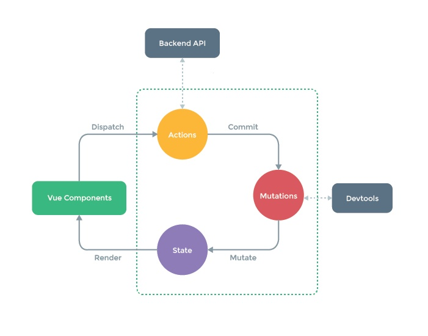

# Pinia

## Qu'est ce que Pinia ?

Pinia est un gestionnaire d'état et une bibliothèque pour des applications Vue.js. Il est la relève de VueX. En d'autres mots, il sert de zone de stockage de données centralisée pour tous les composants d'une application. Des règles sont également mises en place afin d'éviter les mutations non prévisibles.

